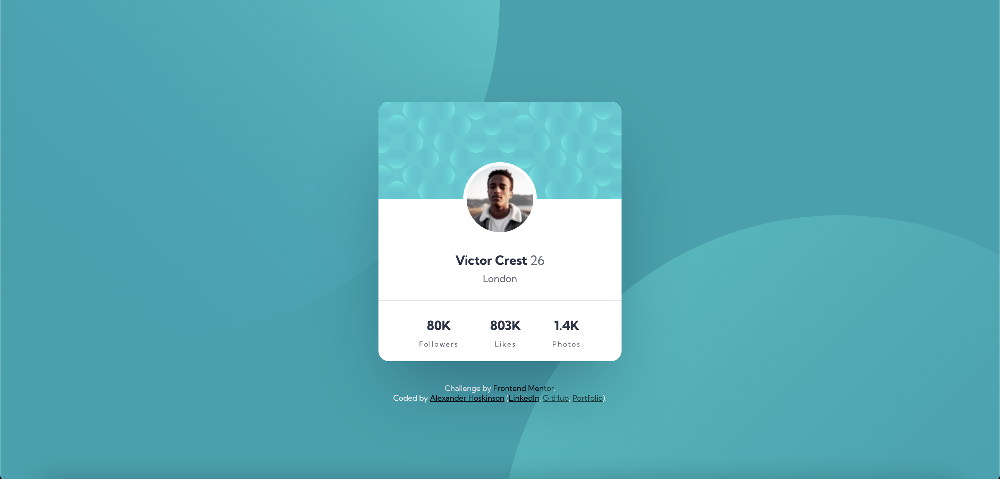

# Frontend Mentor - Profile card component solution

This is a solution to the [Profile card component challenge on Frontend Mentor](https://www.frontendmentor.io/challenges/profile-card-component-cfArpWshJ). Frontend Mentor challenges help you improve your coding skills by building realistic projects.

## Table of contents

- [Overview](#overview)
  - [The challenge](#the-challenge)
  - [Screenshot](#screenshot)
  - [Links](#links)
- [My process](#my-process)
  - [Built with](#built-with)
  - [What I learned](#what-i-learned)
  - [Continued development](#continued-development)
- [Author](#author)

## Overview

### The challenge

Bring this profile card mockup to life.

### Screenshots

Original desktop design mockup:

Screenshot of my desktop result:

### Links

- Solution URL: [https://www.frontendmentor.io/solutions/profile-card-component-using-sass-and-flexbox-QnPEOv679](https://www.frontendmentor.io/solutions/profile-card-component-using-sass-and-flexbox-QnPEOv679)
- Live Site URL: [https://frontend-mentor-projects-coral.vercel.app/profile-card-component/index.html](https://frontend-mentor-projects-coral.vercel.app/profile-card-component/index.html)
- GitHub Repo URL: [https://github.com/alexander215/frontend-mentor-projects/tree/master/profile-card-component](https://github.com/alexander215/frontend-mentor-projects/tree/master/profile-card-component)

## My process

### Built with

- Semantic HTML5 markup
- Flexbox
- Mobile-first workflow
- [Sass](https://sass-lang.com/)
- [BEM Notation](http://getbem.com/)

### What I learned

I really liked getting some practice using SVG elements as part of the background. It was challenging to align them correctly across various screen sizes, so I'm pleased with the result.

### Continued development

If I find time later, I would like to come back and add some subtle animations to make loading and hovering over elements more exciting.

## Author

- Website - [Alexander Hoskinson](https://alexhoskinson.com/)
- Frontend Mentor - [@alexander215](https://www.frontendmentor.io/profile/alexander215)
- GitHub - [@alexander215](https://github.com/alexander215)
- LinkedIn - [Alexander Hoskinson](https://www.linkedin.com/in/alexhoskinson/)
- Twitter - [@AlexHoskinson](https://twitter.com/AlexHoskinson)
